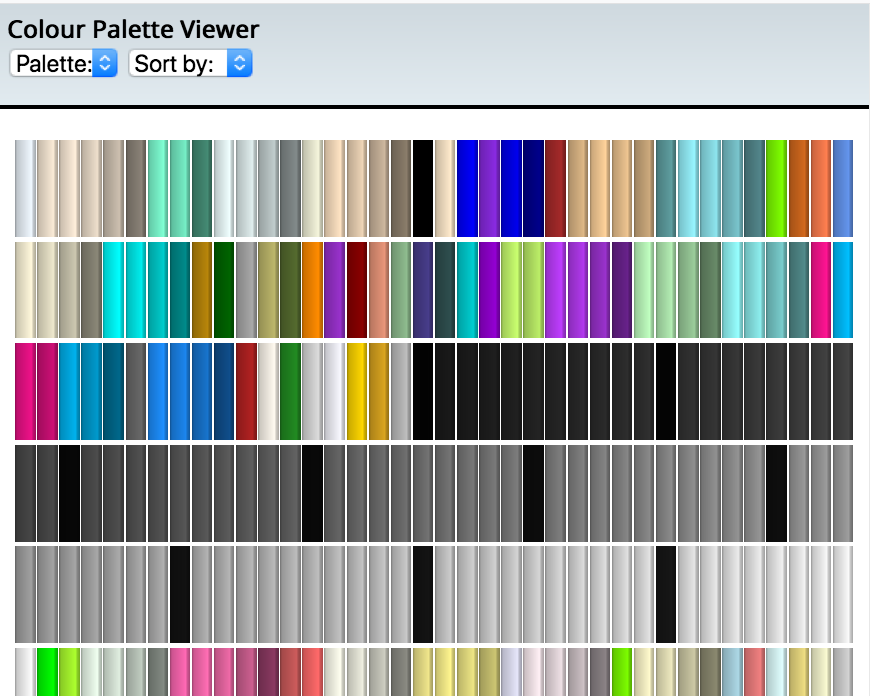

Colour Palette Viewer
=====================

- Node/Express API for handling colour palettes (Web15, CSS Named Colours, WebSafe palette) and sorting them by different quantities
- Front-end Single Page App to view palette

Screenshots
===========

**Main Screen**

**After selecting a colour**

